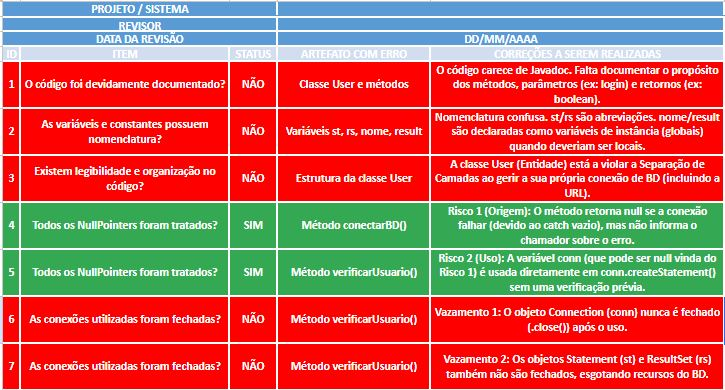
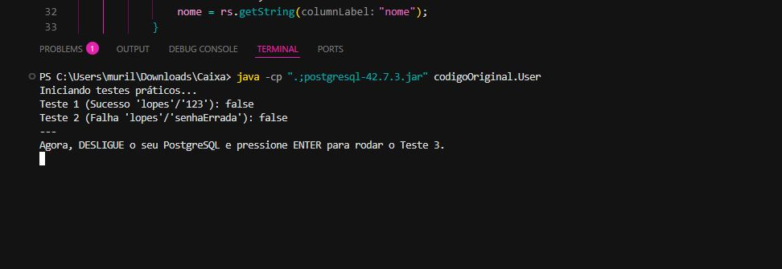
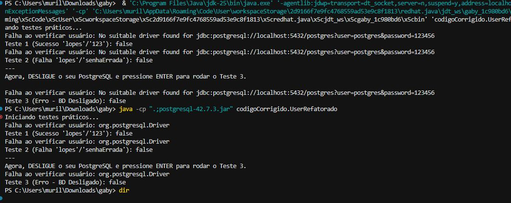

# Análise de Teste de Caixa Branca - Autenticação de Usuário

Este repositório documenta a análise estática e estrutural de uma classe Java (`User.java`), aplicando os conceitos de teste de caixa branca para identificar vulnerabilidades e definir uma estratégia de teste de ciclo.

## Estrutura do Repositório

---

## 1. 📋 Análise Estática (Inspeção de Código)

A primeira fase foi uma inspeção manual do código-fonte original (`codigoOriginal/User.java`). O objetivo foi encontrar "code smells", vulnerabilidades e más práticas de design.

**Principais Falhas Identificadas:**
* **Risco de NullPointerException:** O método `conectarBD` retorna `null` em caso de falha, mas esse retorno não é validado antes de ser usado (`conn.createStatement()`).
* **Vazamento de Recursos:** Os objetos `Connection`, `Statement` e `ResultSet` não são fechados (`.close()`), o que esgotaria o pool de conexões do banco de dados.
* **Violação de Arquitetura:** A classe de entidade `User` está incorretamente gerenciando a conexão com o BD, ferindo o princípio da Separação de Camadas.

### Planilha de Inspeção

A imagem abaixo (de `planilha/palnilha.JPG`) detalha os 7 pontos de falha encontrados durante a inspeção:



*(O arquivo-fonte desta planilha pode ser encontrado em: `planilha/ui_ux.xlsx`)*

---

## 2. 🔬 Análise Estrutural (Teste de Ciclo)

Nesta etapa, decompomos o método `verificarUsuario()` em um grafo visual para analisar sua lógica interna e calcular o número de testes necessários.

### 2.1. Grafo de Fluxo de Controle

Para diferenciar da análise padrão, foi gerado um grafo vertical (`TD`) com nomes de nós descritivos (Ação/Decisão) em vez de números.

### 2.2. Cálculo da Complexidade Ciclomática (V(G))

A Complexidade Ciclomática (V(G)) define o número de caminhos independentes. Usamos a fórmula baseada em Arestas (E) e Nós (N):

$$ V(G) = E - N + 2 $$

Onde, para o nosso grafo acima:
* **N (Nós):** 6 (Ação 1, Decisão A, Decisão B, Ação 2, Ação 3, Ação 4)
* **E (Arestas):** 7 (As 7 setas que ligam os nós)

**Cálculo:**
$$ V(G) = 7 - 6 + 2 = 3 $$

Um V(G) de **3** indica que são necessários **3 Caminhos Básicos** (ou 3 testes) para cobrir 100% da lógica do método.

### 2.3. Caminhos Básicos (com Destaque Visual)

Com base no V(G)=3, a imagem abaixo (exportada do `draw.io`) mostra os três caminhos de teste independentes, cada um com um destaque de cor:


**Caminhos Básicos (Rotas):**

```
1 -> 2 -> 3 -> 4 -> 5 -> 6 -> 7(true) -> 8 -> 12
1 -> 2 -> 3 -> 4 -> 5 -> 6 -> 7(false) -> 9 -> 12
1 -> 2 -> 3 -> 4(catch) -> 10 -> 11(finaliza)
```

**Cálculo (Fórmula `E - N + 2P`):**

```
M = E - N + 2P
M = 13 - 12 + 2x1
M = 1 + 2
M = 3
```

**Variáveis do Cálculo (Corrigido):**

```
N = 12 nós (blocos)

E = 13 arestas (setas)

P = 1 (método)
```

---
## 3. 🧪 Teste Prático & Prova de Falha (Código Original)

Para validar a análise teórica, foi executado um teste prático no `codigoOriginal/User.java` (adicionando um método `main` para forçar os 3 caminhos).

### 3.1. Resultados Observados

O teste prático expôs uma falha crítica: **todos os 3 caminhos retornaram `false`**, incluindo o "Caminho Feliz" (Teste 1), que deveria retornar `true`.



### 3.2. Diagnóstico da Falha

O resultado acima prova que a execução do código **nunca** alcança o `if(rs.next())` (Nó 7). A falha ocorre antes.

O facto de o Teste 1 (BD ligado) e o Teste 3 (BD desligado) darem o mesmo resultado (`false`) prova que a aplicação está sempre a executar o caminho de exceção (Caminho 3).

Esta observação valida 100% as falhas encontradas na Análise Estática (Planilha):
1.  O método `conectarBD()` falha ao tentar se conectar (ex: erro de autenticação com a senha `123456`).
2.  A falha cai no `catch (Exception e) {}` do `conectarBD`, que por estar **vazio**, "engole" o erro e retorna `null`.
3.  No `verificarUsuario()`, a variável `conn` recebe `null`.
4.  O código tenta executar `conn.createStatement()`, o que causa um **`NullPointerException`** (previsto na planilha).
5.  Esse `NPE` cai no `catch (Exception e) {}` do `verificarUsuario()`, que também está **vazio**.
6.  O método termina e retorna `false`.

> **Conclusão:** O teste prático no `codigoOriginal` validou com sucesso a análise estática, provando que os blocos `catch` vazios e a falta de tratamento de `null` são a causa raiz da falha total do método.

*(Opcional: Um print do erro real, `NullPointerException`, pode ser adicionado aqui se o `catch` fosse preenchido apenas para depuração).*



---

## 4. 🛠️ Códigos-Fonte

* **[Versão Original](versãoOriginal/User.java)**: O código-fonte defeituoso que foi alvo desta análise e teste.
* **[Versão Corrigida](VersãoCorrigida/User.java)**: O código refatorado, que usa `try-with-resources` e `PreparedStatement`.# Atividade-Individual-Caixa-Branca-248932--Gabriella-Iglesias
